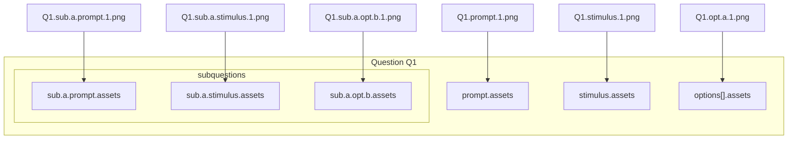
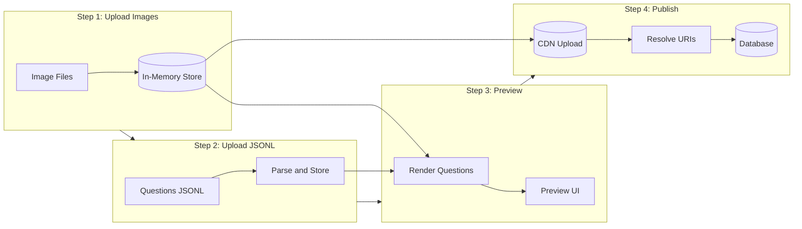

# Image Tagging Strategy for Bulk Upload

## Problem Summary

Images can appear in 6 distinct locations within a question:

1. `content.prompt.assets[]`
2. `content.stimulus.assets[]`
3. `content.options[].assets[]`
4. `content.subquestions[].prompt.assets[]`
5. `content.subquestions[].stimulus.assets[]`
6. `content.subquestions[].options[].assets[]`

You need a deterministic naming convention so that when you bulk-upload images, the **filename itself** tells you exactly where the image belongs. Images should be staged in-memory for preview before final publish to CDN.

---

## Filename-as-Tag Convention

Use a **hierarchical dot-notation** as the image filename that encodes the exact path:

```
{question_id}.{location}.{sub_id?}.{opt_id?}.{index}.{extension}
```

### Filename Structure by Location

| Location | Filename Pattern | Example |
|----------|------------------|---------|
| Prompt | `Q{id}.prompt.{index}.png` | `Q1.prompt.1.png` |
| Stimulus | `Q{id}.stimulus.{index}.png` | `Q1.stimulus.1.png` |
| Option | `Q{id}.opt.{opt_id}.{index}.png` | `Q1.opt.a.1.png` |
| Subquestion Prompt | `Q{id}.sub.{sub_id}.prompt.{index}.png` | `Q1.sub.a.prompt.1.png` |
| Subquestion Stimulus | `Q{id}.sub.{sub_id}.stimulus.{index}.png` | `Q1.sub.a.stimulus.1.png` |
| Subquestion Option | `Q{id}.sub.{sub_id}.opt.{opt_id}.{index}.png` | `Q1.sub.a.opt.b.1.png` |

### Visual Diagram



---

## Staged Workflow



### Step 1: Upload Images to In-Memory Store

Upload images with structured filenames. Store them in-memory (not CDN yet):

```javascript
// In-memory image store
const imageStore = new Map();  // tag → { blob, dataUrl, contentType }

async function uploadImages(files) {
  for (const file of files) {
    const tag = file.name.replace(/\.[^.]+$/, '');  // Remove extension
    const blob = file;
    const dataUrl = await blobToDataUrl(blob);
    
    imageStore.set(tag, {
      blob,
      dataUrl,        // For preview rendering
      contentType: file.type,
      filename: file.name
    });
  }
  return imageStore;
}
```

**Result:** `imageStore` map with `tag → image data`

```
imageStore = {
  "Q1.prompt.1": { blob: Blob, dataUrl: "data:image/png;base64,...", ... },
  "Q1.opt.a.1": { blob: Blob, dataUrl: "data:image/png;base64,...", ... },
  ...
}
```

### Step 2: Upload Questions JSONL

Upload JSONL file with questions referencing images by tag:

```json
{"question_id": "1", "content": {"prompt": {"text": "...", "assets": [{"asset_id": "Q1.prompt.1", "uri": "#", ...}]}, ...}}
{"question_id": "2", "content": {"prompt": {"text": "...", "assets": [{"asset_id": "Q2.prompt.1", "uri": "#", ...}]}, ...}}
```

Store questions in-memory, keeping the tags as-is:

```javascript
const questionStore = new Map();  // question_id → question object

function uploadJsonl(jsonlContent) {
  const lines = jsonlContent.trim().split('\n');
  for (const line of lines) {
    const question = JSON.parse(line);
    questionStore.set(question.question_id, question);
  }
  return questionStore;
}
```

### Step 3: Preview - Render Questions with Images

Render questions by resolving tags to in-memory data URLs:

```javascript
function resolveForPreview(question, imageStore) {
  const resolved = JSON.parse(JSON.stringify(question));  // Deep clone
  
  traverseAllAssets(resolved, (asset) => {
    const tag = asset.asset_id;
    const image = imageStore.get(tag);
    
    if (image) {
      asset.uri = image.dataUrl;  // Use data URL for preview
    } else {
      asset.uri = null;  // Missing image - show placeholder
      console.warn(`Missing image for tag: ${tag}`);
    }
  });
  
  return resolved;
}

// Render in UI
function renderQuestion(questionId) {
  const question = questionStore.get(questionId);
  const resolved = resolveForPreview(question, imageStore);
  // Render resolved question with embedded images
}
```

**Preview shows:**

- Questions with images rendered inline (via data URLs)
- Warnings for any missing images
- No CDN dependency - fully local preview

### Step 4: Publish - Upload to CDN and Save

On publish, upload images to CDN and resolve final URIs:

```javascript
async function publishQuestions(questionIds) {
  // 1. Collect all image tags needed for these questions
  const neededTags = collectImageTags(questionIds, questionStore);
  
  // 2. Upload images to CDN
  const cdnResults = new Map();  // tag → { asset_id, uri }
  
  for (const tag of neededTags) {
    const image = imageStore.get(tag);
    if (!image) {
      throw new Error(`Missing image for tag: ${tag}`);
    }
    
    // Upload to CDN
    const { uri } = await uploadToCdn(image.blob, image.filename);
    
    // Compute SHA-256 hash
    const asset_id = await computeSha256(image.blob);
    
    cdnResults.set(tag, { asset_id, uri });
  }
  
  // 3. Resolve questions with final CDN URIs
  const publishedQuestions = [];
  
  for (const qid of questionIds) {
    const question = JSON.parse(JSON.stringify(questionStore.get(qid)));
    
    traverseAllAssets(question, (asset) => {
      const tag = asset.asset_id;
      const cdn = cdnResults.get(tag);
      if (cdn) {
        asset.asset_id = cdn.asset_id;  // Replace with SHA-256
        asset.uri = cdn.uri;            // Replace with CDN URL
      }
    });
    
    publishedQuestions.push(question);
  }
  
  // 4. Save to database
  await saveToDatabase(publishedQuestions);
  
  return publishedQuestions;
}
```

---

## Helper: Traverse All Assets

Utility function to traverse all asset locations in a question:

```javascript
function traverseAllAssets(question, callback) {
  const content = question.content;
  
  // Prompt assets
  if (content.prompt?.assets) {
    content.prompt.assets.forEach(callback);
  }
  
  // Stimulus assets
  if (content.stimulus?.assets) {
    content.stimulus.assets.forEach(callback);
  }
  
  // Option assets
  if (content.options) {
    content.options.forEach(opt => {
      if (opt.assets) opt.assets.forEach(callback);
    });
  }
  
  // Subquestion assets
  if (content.subquestions) {
    content.subquestions.forEach(sub => {
      if (sub.prompt?.assets) sub.prompt.assets.forEach(callback);
      if (sub.stimulus?.assets) sub.stimulus.assets.forEach(callback);
      if (sub.options) {
        sub.options.forEach(opt => {
          if (opt.assets) opt.assets.forEach(callback);
        });
      }
    });
  }
}
```

---

## Complete Example

### Step 1: Image Files Uploaded

```
Q5.prompt.1.png      → imageStore["Q5.prompt.1"]
Q5.stimulus.1.png    → imageStore["Q5.stimulus.1"]
Q5.opt.a.1.png       → imageStore["Q5.opt.a.1"]
Q5.sub.a.prompt.1.png → imageStore["Q5.sub.a.prompt.1"]
```

### Step 2: JSONL Uploaded

```json
{"question_id": "5", "content": {"prompt": {"text": "Look at the image:", "assets": [{"asset_id": "Q5.prompt.1", "uri": "#", "ai_generation_prompt": "Bar graph", "alt": "Bar graph"}]}, "stimulus": {"text": "Study this:", "assets": [{"asset_id": "Q5.stimulus.1", "uri": "#", "ai_generation_prompt": "Venn diagram", "alt": "Venn diagram"}]}, "options": [{"opt_id": "a", "assets": [{"asset_id": "Q5.opt.a.1", "uri": "#", "ai_generation_prompt": "Option A", "alt": "Option A"}]}], "subquestions": [{"sub_id": "a", "prompt": {"text": "What does this show?", "assets": [{"asset_id": "Q5.sub.a.prompt.1", "uri": "#", "ai_generation_prompt": "Diagram", "alt": "Diagram"}]}}]}}
```

### Step 3: Preview

Questions render with images resolved from in-memory data URLs. User reviews and validates.

### Step 4: Publish

After publish, the final question in database:

```json
{
  "question_id": "5",
  "content": {
    "prompt": {
      "text": "Look at the image:",
      "assets": [{
        "asset_id": "a1b2c3d4e5...",
        "uri": "https://cdn.example.com/images/Q5.prompt.1.png",
        "ai_generation_prompt": "Bar graph",
        "alt": "Bar graph"
      }]
    }
  }
}
```

---

## Summary

| Stage | Action | Storage | URI Value |
|-------|--------|---------|-----------|
| Upload Images | Store image blobs | In-memory Map | N/A |
| Upload JSONL | Store questions with tags | In-memory Map | `#` (placeholder) |
| Preview | Resolve tags → data URLs | In-memory | `data:image/...` |
| Publish | Upload to CDN, compute hash | CDN + Database | `https://cdn.../` |

This staged workflow allows full preview and validation before any CDN costs are incurred.
