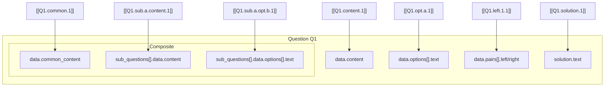
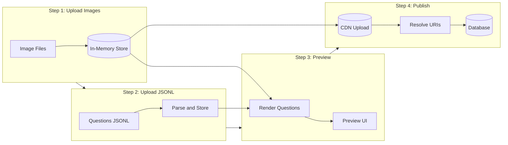

# Image Tagging Strategy for Bulk Upload (Schema v4.6)

## Schema Overview

In schema v4.6, images are embedded as **tokens** within RichText strings using the `[[image-id]]` syntax:

```
"content": "Look at the diagram below:\n\n[[Q1.content.1]]\n\nWhat shape is shown?"
```

Images can appear anywhere RichText is used:

| Location | Field Path | Example |
|----------|------------|---------|
| Main content | `data.content` | MCQ, FIB, MATCH, SUBJECTIVE |
| MCQ options | `data.options[].text` | Option text with images |
| Match pairs | `data.pairs[].left`, `data.pairs[].right` | Left/right match items |
| Composite shared content | `data.common_content` | Shared context for sub-questions |
| Sub-question content | `data.sub_questions[].data.content` | Individual sub-question |
| Sub-question options | `data.sub_questions[].data.options[].text` | Sub-question MCQ options |
| Solution | `solution.text` | Explanation with diagrams |

---

## Filename-as-Tag Convention

Use a **hierarchical dot-notation** as the image filename that becomes the token ID:

```
{question_id}.{location}.{sub_id?}.{opt_id?}.{index}.{extension}
```

### Filename Structure by Location

| Location | Filename Pattern | Token in RichText |
|----------|------------------|-------------------|
| Main content | `Q{id}.content.{index}.png` | `[[Q1.content.1]]` |
| MCQ option | `Q{id}.opt.{opt_id}.{index}.png` | `[[Q1.opt.a.1]]` |
| Match left | `Q{id}.left.{pair_index}.{index}.png` | `[[Q1.left.1.1]]` |
| Match right | `Q{id}.right.{pair_index}.{index}.png` | `[[Q1.right.1.1]]` |
| Composite common | `Q{id}.common.{index}.png` | `[[Q1.common.1]]` |
| Sub-question content | `Q{id}.sub.{sub_id}.content.{index}.png` | `[[Q1.sub.a.content.1]]` |
| Sub-question option | `Q{id}.sub.{sub_id}.opt.{opt_id}.{index}.png` | `[[Q1.sub.a.opt.b.1]]` |
| Solution | `Q{id}.solution.{index}.png` | `[[Q1.solution.1]]` |

### Visual Diagram



---

## Staged Workflow



### Step 1: Upload Images to In-Memory Store

Upload images with structured filenames. Store them in-memory (not CDN yet):

```javascript
// In-memory image store
const imageStore = new Map();  // tag → { blob, dataUrl, contentType }

async function uploadImages(files) {
  for (const file of files) {
    const tag = file.name.replace(/\.[^.]+$/, '');  // Remove extension → "Q1.content.1"
    const blob = file;
    const dataUrl = await blobToDataUrl(blob);
    
    imageStore.set(tag, {
      blob,
      dataUrl,        // For preview rendering
      contentType: file.type,
      filename: file.name
    });
  }
  return imageStore;
}
```

**Result:** `imageStore` map with `tag → image data`

```
imageStore = {
  "Q1.content.1": { blob: Blob, dataUrl: "data:image/png;base64,...", ... },
  "Q1.opt.a.1": { blob: Blob, dataUrl: "data:image/png;base64,...", ... },
  ...
}
```

### Step 2: Upload Questions JSONL

Upload JSONL file with questions containing `[[tag]]` tokens in RichText fields:

```json
{"id": "Q1", "type": "MCQ", "data": {"content": "Look at the shapes:\n\n[[Q1.content.1]]\n\nWhich is a triangle?", "options": [{"id": "a", "text": "[[Q1.opt.a.1]]"}, {"id": "b", "text": "[[Q1.opt.b.1]]"}]}, ...}
```

Store questions in-memory:

```javascript
const questionStore = new Map();  // id → question object

function uploadJsonl(jsonlContent) {
  const lines = jsonlContent.trim().split('\n');
  for (const line of lines) {
    const question = JSON.parse(line);
    questionStore.set(question.id, question);
  }
  return questionStore;
}
```

### Step 3: Preview - Render Questions with Images

Parse RichText and replace `[[tag]]` tokens with in-memory data URLs:

```javascript
// Regex to find image tokens
const IMAGE_TOKEN_REGEX = /\[\[([^\]]+)\]\]/g;

function resolveRichTextForPreview(richText, imageStore) {
  if (!richText) return richText;
  
  return richText.replace(IMAGE_TOKEN_REGEX, (match, tag) => {
    const image = imageStore.get(tag);
    if (image) {
      // Return markdown image with data URL for preview
      return ``;
    } else {
      console.warn(`Missing image for tag: ${tag}`);
      return `[Missing: ${tag}]`;
    }
  });
}

function resolveQuestionForPreview(question, imageStore) {
  const resolved = JSON.parse(JSON.stringify(question));  // Deep clone
  
  traverseAllRichText(resolved, (text, path) => {
    return resolveRichTextForPreview(text, imageStore);
  });
  
  return resolved;
}
```

**Preview shows:**

- Questions with images rendered inline (via data URLs)
- Warnings for any missing images
- No CDN dependency - fully local preview

### Step 4: Publish - Upload to CDN and Save

On publish, upload images to CDN and replace tokens with final URLs:

```javascript
async function publishQuestions(questionIds) {
  // 1. Collect all image tags from these questions
  const neededTags = collectImageTags(questionIds, questionStore);
  
  // 2. Upload images to CDN
  const cdnResults = new Map();  // tag → { uri }
  
  for (const tag of neededTags) {
    const image = imageStore.get(tag);
    if (!image) {
      throw new Error(`Missing image for tag: ${tag}`);
    }
    
    // Upload to CDN
    const { uri } = await uploadToCdn(image.blob, image.filename);
    cdnResults.set(tag, { uri });
  }
  
  // 3. Resolve questions with final CDN URIs
  const publishedQuestions = [];
  
  for (const qid of questionIds) {
    const question = JSON.parse(JSON.stringify(questionStore.get(qid)));
    
    traverseAllRichText(question, (text) => {
      return text.replace(IMAGE_TOKEN_REGEX, (match, tag) => {
        const cdn = cdnResults.get(tag);
        if (cdn) {
          return ``;  // Replace with CDN URL
        }
        return match;
      });
    });
    
    publishedQuestions.push(question);
  }
  
  // 4. Save to database
  await saveToDatabase(publishedQuestions);
  
  return publishedQuestions;
}
```

---

## Helper: Traverse All RichText Fields

Utility function to traverse all RichText locations in a question:

```javascript
function traverseAllRichText(question, transformer) {
  const data = question.data;
  const type = question.type;
  
  // Main content (MCQ, FIB, MATCH, SUBJECTIVE)
  if (data.content) {
    data.content = transformer(data.content, 'data.content');
  }
  
  // Composite common content
  if (data.common_content) {
    data.common_content = transformer(data.common_content, 'data.common_content');
  }
  
  // MCQ/FIB options
  if (data.options) {
    data.options.forEach((opt, i) => {
      if (opt.text) {
        opt.text = transformer(opt.text, `data.options[${i}].text`);
      }
    });
  }
  
  // Match pairs
  if (data.pairs) {
    data.pairs.forEach((pair, i) => {
      if (pair.left) pair.left = transformer(pair.left, `data.pairs[${i}].left`);
      if (pair.right) pair.right = transformer(pair.right, `data.pairs[${i}].right`);
    });
  }
  
  // Composite sub-questions (recursive)
  if (data.sub_questions) {
    data.sub_questions.forEach((sub, i) => {
      traverseAllRichText({ type: sub.type, data: sub.data }, transformer);
    });
  }
  
  // Solution
  if (question.solution?.text) {
    question.solution.text = transformer(question.solution.text, 'solution.text');
  }
}
```

---

## Helper: Extract All Image Tags

Utility to find all `[[tag]]` references in a question:

```javascript
function collectImageTags(questionIds, questionStore) {
  const tags = new Set();
  const IMAGE_TOKEN_REGEX = /\[\[([^\]]+)\]\]/g;
  
  for (const qid of questionIds) {
    const question = questionStore.get(qid);
    
    traverseAllRichText(question, (text) => {
      let match;
      while ((match = IMAGE_TOKEN_REGEX.exec(text)) !== null) {
        tags.add(match[1]);
      }
      return text;  // Don't modify
    });
  }
  
  return tags;
}
```

---

## Complete Example

### Step 1: Image Files Uploaded

```
Q5.content.1.png       → imageStore["Q5.content.1"]
Q5.opt.a.1.png         → imageStore["Q5.opt.a.1"]
Q5.opt.b.1.png         → imageStore["Q5.opt.b.1"]
Q5.solution.1.png      → imageStore["Q5.solution.1"]
```

### Step 2: JSONL with Token References

```json
{
  "id": "Q5",
  "metadata": {
    "grade": 3,
    "subject": "Mathematics",
    "chapter": 2,
    "section": "A",
    "difficulty": "Easy",
    "marks": 1,
    "pool": "Practice"
  },
  "type": "MCQ",
  "data": {
    "content": "Look at the base-ten blocks below:\n\n[[Q5.content.1]]\n\nWhich number does this represent?",
    "options": [
      { "id": "a", "text": "[[Q5.opt.a.1]] 377" },
      { "id": "b", "text": "[[Q5.opt.b.1]] 387" }
    ]
  },
  "solution": {
    "text": "Count the blocks as shown:\n\n[[Q5.solution.1]]\n\n3 hundreds + 7 tens + 7 ones = **377**"
  }
}
```

### Step 3: Preview

Tokens are replaced with data URLs for local rendering:

```json
{
  "data": {
    "content": "Look at the base-ten blocks below:\n\n\n\nWhich number does this represent?"
  }
}
```

### Step 4: Publish

After publish, tokens are replaced with CDN URLs:

```json
{
  "data": {
    "content": "Look at the base-ten blocks below:\n\n\n\nWhich number does this represent?"
  }
}
```

---

## Summary

| Stage | Action | Token Value |
|-------|--------|-------------|
| Authoring | Write JSONL with tokens | `[[Q1.content.1]]` |
| Upload Images | Store blobs in-memory | N/A |
| Preview | Replace tokens → data URLs | `` |
| Publish | Replace tokens → CDN URLs | `` |

### Key Differences from Previous Schema

| Aspect | Old Schema (v2) | New Schema (v4.6) |
|--------|-----------------|-------------------|
| Image reference | Separate `assets[]` arrays | `[[tag]]` tokens in RichText |
| Location | Fixed paths (prompt, stimulus, options) | Anywhere in RichText string |
| Flexibility | One image per location | Multiple images inline with text |
| Resolution | Replace `asset_id` + `uri` fields | Replace token with markdown image |

This token-based approach is more flexible and allows images to be embedded naturally within text content.
